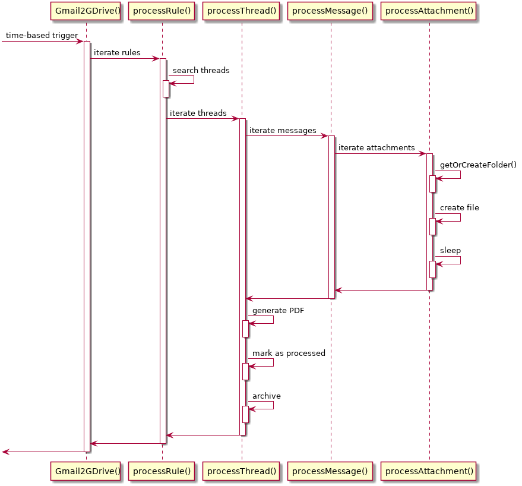

Gmail2GDrive
============

Gmail2GDrive is a Google Apps Script which automatically stores and sorts Gmail attachments into Google Drive folders, and can also save the thread as a PDF file.

It does so by defining a list of rules which consist of Gmail search filters and Google Drive destination folders.
This way the attachments of periodic emails can be automatically organized in folders without the need to install and run anything on the client.

Features
--------

* Automatically sorts your attachments in the background
* Filter for relevant emails
* Specify the destination folder
* Rename attachments (using date format strings and email subject as filenames)
* Save the thread as a PDF File

Limitations
-----------

Gmail2GDrive currently has the following limitations:

* **Processing is done on a per-thread basis with a single email message per thread.** This is so because marking already processed emails is done using labels and GMail only alows to attach labels to a whole thread not to single email messages. For typical usage scenarios this is not really a problem but it may be if you want to process emails that are grouped by GMail into a thread (e.g. forum messages).

Setup
-----

1. Open [Google Apps Script](https://script.google.com/).
2. Create an empty project.
3. Give the project a name (e.g. MyGmail2GDrive)
4. Replace the content of the created file Code.gs with the provided [Code.gs](https://github.com/ahochsteger/gmail2gdrive/blob/master/Code.gs) and save the changes.
5. Create a new script file with the name 'Config' and replace its content with the provided [Config.gs](https://github.com/ahochsteger/gmail2gdrive/blob/master/Config.gs) and save the changes.
6. Adjust the configuration to your needs. It is recommended to restrict the timeframe using 'newerThan' to prevent running into API quotas by Google.
7. Test the script by manually executing the function performGmail2GDrive.
8. Create a time based trigger which periodically executes 'Gmail2GDrive' (e.g. once per day) to automatically organize your Gmail attachments within Google Drive.

Global Configuration
--------------------

* globalFilter: Global filter expression (see <https://support.google.com/mail/answer/7190?hl=en> for avialable search operators)
  * Example: "globalFilter": "has:attachment -in:trash -in:drafts -in:spam"
* processedLabel: The GMail label to mark processed threads (will be created, if not existing)
  * Example: "processedLabel": "to-gdrive/processed"
* sleepTime: Sleep time in milliseconds between processed messages
  * Example: "sleepTime": 100
* maxRuntime: Maximum script runtime in seconds (Google Scripts will be killed after 5 minutes)
  * Example: "maxRuntime": 280
* newerThan: Only process message newer than (leave empty for no restriction; use d, m and y for day, month and year)
  * Example: "newerThan": "1m"
* timezone: Timezone for date/time operations
  * Example: "timezone": "GMT"
* rules: List of rules to be processed
  * Example: "rules": [ {..rule1..}, {..rule2..}, ... ]

Rule Configuration
------------------

A rule supports the following parameters documentation:

* filter (String, mandatory): a typical gmail search expression (see <http://support.google.com/mail/bin/answer.py?hl=en&answer=7190>)
* folder (String, mandatory): a path to an existing Google Drive folder (will be created, if not existing)
* archive (boolean, optional): Should the gmail thread be archived after processing? (default: false)
* filenameFrom (String, optional): The attachment filename that should be renamed when stored in Google Drive
* filenameFromRegexp (String, optional): A regular expression to specify only relevant attachments
* filenameTo (String, optional): The pattern for the new filename of the attachment. If 'filenameFrom' is not given then this will be the new filename for all attachments.
  * You can use '%s' to insert the email subject and date format patterns like 'yyyy' for year, 'MM' for month and 'dd' for day as pattern in the filename.
  * See <https://developers.google.com/apps-script/reference/utilities/utilities#formatDate(Date,String,String)> for more information on the possible date format strings.
* saveThreadPDF (boolean, optional): Should the thread be saved as a PDF? (default: false)

Example Configuration
---------------------

```javascript
/**
 * Configuration for Gmail2GDrive
 * See https://github.com/ahochsteger/gmail2gdrive/blob/master/README.md for a config reference
 */
function getGmail2GDriveConfig() {
  return {
    // Global filter
    "globalFilter": "has:attachment -in:trash -in:drafts -in:spam",
    // Gmail label for processed threads (will be created, if not existing):
    "processedLabel": "to-gdrive/processed",
    // Sleep time in milli seconds between processed messages:
    "sleepTime": 100,
    // Maximum script runtime in seconds (google scripts will be killed after 5 minutes):
    "maxRuntime": 280,
    // Only process message newer than (leave empty for no restriction; use d, m and y for day, month and year):
    "newerThan": "1m",
    // Timezone for date/time operations:
    "timezone": "GMT",
    // Processing rules:
    "rules": [
      { // Store all attachments sent to my.name+scans@gmail.com to the folder "Scans"
        "filter": "to:my.name+scans@gmail.com",
        "folder": "'Scans'-yyyy-MM-dd"
      },
      { // Store all attachments from example1@example.com to the folder "Examples/example1"
        "filter": "from:example1@example.com",
        "folder": "'Examples/example1'"
      },
      { // Store all pdf attachments from example2@example.com to the folder "Examples/example2"
        "filter": "from:example2@example.com",
        "folder": "'Examples/example2'",
        "filenameFromRegexp": ".*\.pdf$"
      },
      { // Store all attachments from example3a@example.com OR from:example3b@example.com
        // to the folder "Examples/example3ab" while renaming all attachments to the pattern
        // defined in 'filenameTo' and archive the thread.
        "filter": "(from:example3a@example.com OR from:example3b@example.com)",
        "folder": "'Examples/example3ab'",
        "filenameTo": "'file-'yyyy-MM-dd-'%s.txt'",
        "archive": true
      },
      {
        // Store threads marked with label "PDF" in the folder "PDF Emails" als PDF document.
        "filter": "label:PDF",
        "saveThreadPDF": true,
        "folder": "PDF Emails"
      },
      { // Store all attachments named "file.txt" from example4@example.com to the
        // folder "Examples/example4" and rename the attachment to the pattern
        // defined in 'filenameTo' and archive the thread.
        "filter": "from:example4@example.com",
        "folder": "'Examples/example4'",
        "filenameFrom": "file.txt",
        "filenameTo": "'file-'yyyy-MM-dd-'%s.txt'"
      }
    ]
  };
}
```

Processing overview
-------------------

The following diagramm gives a brief overview about how the processing actually works:



NOTE: processRule(), processThread() and processAttachment() are modelled as separate functions for better visibility which is not visible as separate functions in Code.gs

Feedback and contributions
--------------------------

Feedback and contributions is well appreciated via [Github](https://github.com/ahochsteger/gmail2gdrive).

Thanks
------

I'd like to thank [Amit Agarwal](http://www.labnol.org/about/) who provided similar functionality in his article [Send your Gmail Attachments to Google Drive](http://www.labnol.org/internet/send-gmail-to-google-drive/21236/) from which Gmail2GDrive evolved to provide more flexibility.
Also thanks to all [contributors](https://github.com/ahochsteger/gmail2gdrive/graphs/contributors) that extended GMail2GDrive with new functionality.
